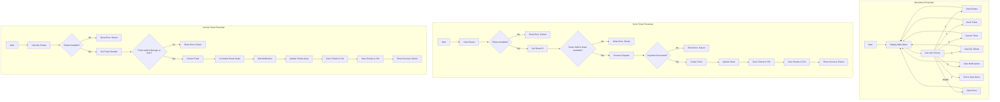

```mermaid
graph TD
    subgraph Main Menu Flowchart
        A[Start] --> B[Display Main Menu]
        B --> C[Get User Choice]
        C -->|1| D[View Routes]
        C -->|2| E[Book Ticket]
        C -->|3| F[Cancel Ticket]
        C -->|4| G[View My Tickets]
        C -->|5| H[View Notifications]
        C -->|6| I[Exit to User Menu]
        C -->|Invalid| J[Show Error]
        D --> B
        E --> B
        F --> B
        G --> B
        H --> B
        J --> B
    end

    subgraph Book Ticket Flowchart
        BA[Start] --> BB[View Routes]
        BB --> BC{Routes Available?}
        BC -->|No| BD[Show Error, Return]
        BC -->|Yes| BE[Get Route ID]
        BE --> BF{Route Valid & Seats Available?}
        BF -->|No| BG[Show Error, Return]
        BF -->|Yes| BH[Process Payment]
        BH --> BI{Payment Successful?}
        BI -->|No| BJ[Show Error, Return]
        BI -->|Yes| BK[Create Ticket]
        BK --> BL[Update Seats]
        BL --> BM[Save Tickets to File]
        BM --> BN[Save Routes to File]
        BN --> BO[Show Success, Return]
    end

    subgraph Cancel Ticket Flowchart
        CA[Start] --> CB[View My Tickets]
        CB --> CC{Tickets Available?}
        CC -->|No| CD[Show Error, Return]
        CC -->|Yes| CE[Get Ticket Number]
        CE --> CF{Ticket Valid & Belongs to User?}
        CF -->|No| CG[Show Error, Return]
        CF -->|Yes| CH[Cancel Ticket]
        CH --> CI[Increment Route Seats]
        CI --> CJ[Add Notification]
        CJ --> CK[Update Tickets Array]
        CK --> CL[Save Tickets to File]
        CL --> CM[Save Routes to File]
        CM --> CN[Show Success, Return]
    end
```